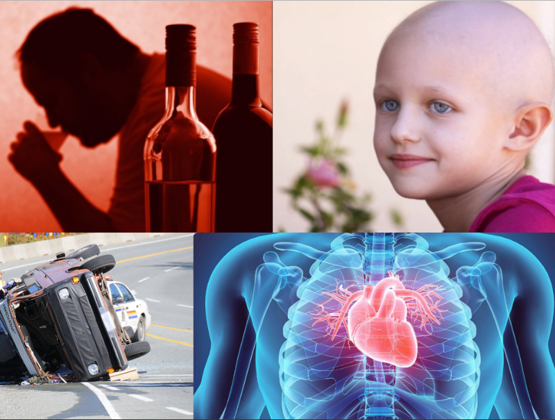
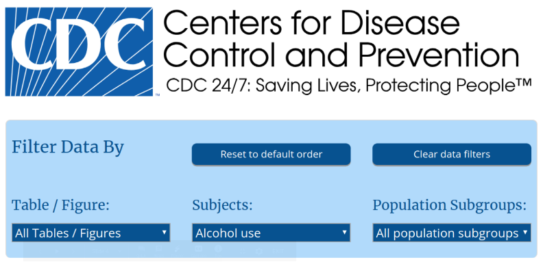

## PROJECT SUMMARY

### PROJECT INFORMATION

- Project title: 
- Group name: GroupOne
- Team names: [Shraddha Kulkarni (shraddhk), Seher Khan (seherkha)]

### PROJECT ARTIFACTS

- [Demonstration URL](<demo-url>)
- [Presentation PDF](<presentation-pdf-url>) and [transcript](<presentation-transcript-md-url>)
- [Article](<article-pdf-url>) and [Overleaf URL](https://www.overleaf.com/read/qdrprfctmrhc)
- [YouTube video](<youtube-video-url>)

# INF 554 Assignment for 5: 

# Project Proposal     
   
## Slide 0: Cover Slide    
       
**Disease Control & Prevention Analysis** is a web application for visualizing data for diseases leading to death in the US

## Slide 1: Introduction - Motivation    
      
* Some of the leading causes of death in the US include heart disease, cancer, alcholism and injuries caused by accidents    
* Many of these are preventable, and being able to visualize the numbers could help us develop improved strategies to avoid and alleviate their occurance    

## Slide 2: Introduction - Audience   
       
* We expect our application to be useful for the general public. It will make them more aware of the diseases they are suspectible to based on their location and other demographic traits
* Medical students could also benefit from knowing which fields require their interest the most
* Finally, policy makers would greatly benefit from a tool that would help identify major health problems in their region and so they can draft effective policies

   
In the next few Slides, we are going to cover the type of visualization we are planning to make for the project. One common features among all these visualizations is that user will be able to filter their results for a particular cause like heart disease, cancer, diabetes, etc.       

## Slide 3: Overall Picture    
      
* We will create various Bubble Charts, Strip Charts, Bar Charts and Heatmaps to analyze the spread of diseases in the whole Country.    
* These charts will help us understand the overall trends in the past 2 Decades.     

## Slide 4: State Comparision   
      
* The next is the functionality through which the user will be able to draw comparisions between states.          
* User will be able to input 2 states of their choice, and based on their selection, we will display charts and plots comparing the two mentioned states.       

## Slide 5: Zooming into a Specific State
      
* Increased granuality of data.   
* In this one, we are going to split the window into two parts, the right side will display the overall geochart, and selecting a particular state in it, will pane into that porition of the map of the left hand side.    
* The Bottom charts will display charts pertaining to that State as seen in the image.     

## Slide 6: Historical
      
* Ability to see trends across the country and within a region for selected diseases.     
* Such time-series plots are very useful for Trend, Seasonality, and Cyclical Analysis.    

## Slide 7: Clustering
      
* This is an additional part that we are thinking to implement. Since we have good knowledge of Clustering and Time-Series Prediction, we were thinking of applying some basic algorithms for the future prediction and visualizing the results onto the plot.    
* Clustering will help the policy-makers to come up with regulations for the similar set of states based on the conditions.    
* Besides, that Time-Series Prediction is very useful as it gives us a number predicting total number of deaths that could occur. Hence, knowing that preventive steps can be taken in advance.   

## Slide 8: Data Source    
    
* We will be using data from the Centers for Diease Control and Prevention
* Their data can be filtered by time, disease and demographic attributes

## Slide 9: Technologies
   
* The above technologies will be used. We will implement the features as we learn about them in the class.     
* Besides that we will refer to their official Documentations. There are a lot of examples given on D3.js website which are good for reference.    
* Both of us will be working on developing the visuals, one at a time. We will subsequently attach the code into our main html Template.   

## Slide 10: Timeline 
        
* The figure explains it all.    
