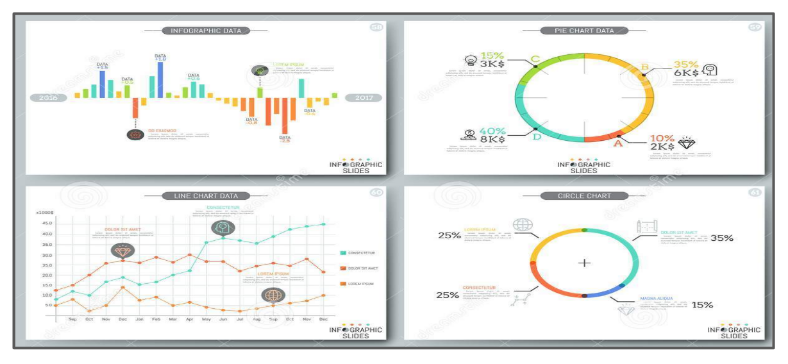
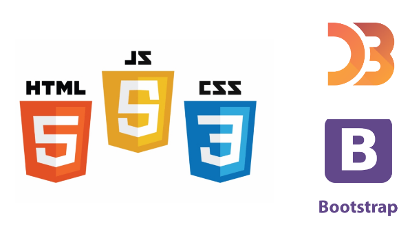

## PROJECT SUMMARY

### PROJECT INFORMATION

- Project title: 
- Group name: GroupOne
- Team names: [Shraddha Kulkarni (shraddhk), Seher Khan (seherkha)]

### PROJECT ARTIFACTS

- [Demonstration URL](<demo-url>)
- [Presentation PDF](<presentation-pdf-url>) and [transcript](<presentation-transcript-md-url>)
- [Article](<article-pdf-url>) and [Overleaf URL](https://www.overleaf.com/read/qdrprfctmrhc)
- [YouTube video](<youtube-video-url>)

# INF 554 Assignment for 5: 

# Project Proposal     
   
## Slide 0: Cover Slide    
       
**Disease Control & Prevention Analysis** is a web application for visualizing data for diseases leading to death in the US

## Slide 1: Introduction - Motivation    
      
* Some of the leading causes of death in the US include heart disease, cancer, alcholism and injuries caused by accidents    
* Many of these are preventable, and being able to visualize the numbers could help us develop improved strategies to avoid and alleviate their occurance    

## Slide 2: Introduction - Audience   
       
* We expect our application to be useful for the general public. It will make them more aware of the diseases they are suspectible to based on their location and other demographic traits
* Medical students could also benefit from knowing which fields require their interest the most
* Finally, policy makers would greatly benefit from a tool that would help identify major health problems in their region and so they can draft effective policies

   
In the next few Slides, we are going to cover the type of visualization we are planning to make for the project. One common features among all these visualizations is that user will be able to filter their results for a particular cause like heart disease, cancer, diabetes, etc.       

## Slide 3: Overall Picture    
      
* We will create various Bubble Charts, Strip Charts, Bar Charts and Heatmaps to analyze the spread of diseases in the whole Country.    
* These charts will help us understand the overall trends in the past 2 Decades.     

## Slide 4: State Comparision   
      
* The next is the functionality through which the user will be able to draw comparisions between states.          
* User will be able to input 2 states of their choice, and based on their selection, we will display charts and plots comparing the two mentioned states.       

## Slide 5: Zooming into a Specific State
      
* Increased granuality of data.   
* In this one, we are going to split the window into two parts, the right side will display the overall geochart, and selecting a particular state in it, will pane into that porition of the map of the left hand side.    
* The Bottom charts will display charts pertaining to that State as seen in the image.     

## Slide 6: Historical
      
* Ability to see trends across the country and within a region for selected diseases.     
* Such time-series plots are very useful for Trend, Seasonality, and Cyclical Analysis.    

## Slide 7: Clustering
      
* This is an additional part that we are thinking to implement. Since we have good knowledge of Clustering and Time-Series Prediction, we were thinking of applying some basic algorithms for the future prediction and visualizing the results onto the plot.    
* Clustering will help the policy-makers to come up with regulations for the similar set of states based on the conditions.    
* Besides, that Time-Series Prediction is very useful as it gives us a number predicting total number of deaths that could occur. Hence, knowing that preventive steps can be taken in advance.   

## Slide 8: Data Source    
    
* We will be using data from the Centers for Diease Control and Prevention
* Their data can be filtered by time, disease and demographic attributes

## Slide 9: Technologies
   
* The above technologies will be used. We will implement the features as we learn about them in the class.     
* Besides that we will refer to their official Documentations. There are a lot of examples given on D3.js website which are good for reference.    
* Both of us will be working on developing the visuals, one at a time. We will subsequently attach the code into our main html Template.   

## Slide 10: Timeline 
        
* The figure explains it all.    
     
        
           

# Project Implementation     
# INF554 Project    
# Airline On-time Performance    

## PROJECT SUMMARY
This is a visualization for US flights on-time performance over the years 2000-2018. Many of the flight booking websites provide information on carriers, price and time. Our project is to add a new parameter of delay associated so that the viewers can make a more informed decision on his travel. We created a website that contains visual representations of various graphical forms such as maps, bar, donut etc. Each of the charts represent information such as delays, airport connections between cities, daily statistics of flight delay and also the  cause of delays.

We portray the story of a traveller and his journey from home to destination through this project.

### PROJECT INFORMATION    

- Project title: US Flights on-time Performance<Airline On-Time Performance.>
- Group name: GroupOne
- Team names: Seher Khan (seherkha@usc.edu), Shraddha Kulkarni (shraddhk@usc.edu)

### PROJECT ARTIFACTS

- [Demonstration URL](<http://www-scf.usc.edu/~agiri/project/>)
- [Presentation PDF](<final.pdf>) and [transcript](transcript.md)
- [Article](article.pdf) and [Overleaf URL](<https://www.overleaf.com/3368746295nzznwtsvvycw>)
- [YouTube video](<https://www.youtube.com/watch?v=ljFurMapzwQ&feature=youtu.be>)

### Visualizations
The following visualizations have been created for on-time airline performance
- US flights dot map that populates a bar chart which displays aggregated value of departure delay of all carriers of selected city. The delay in the bar chart based on carriers can be sorted according to ascending, descending or alphabetical order.
- Airport Connectivity: Airports in all cities of US are represented as a proportional symbol map determined by the size of the airport. It displays all the connecting airports from the user selected airport.
- Carrier Statistics represented by a line chart which shows busy airports which is determined by the count of inbound and outbound flights of various cities in the US.
- Carrier Information chart represents the average arrival and departure delay of the selected carrier in minutes along with a card that contains information about carrier type.
- US on-time flight performance visualized through a bipartite graph. The left side represents two-way verticle bipartite matchings between cause of delay and flight carriers. The right side represents cause of delay Vs major aiports.

## Development

The development of this assignment is done using HTML, CSS, JavaScript, TypeScript, node.js, npm, angular and D3.js and particles.js library.

### Set-Up
  
Following are the environments used for set-up and development.

Replace particles.js file in node_modules/particlesjs/dist/particles.js with particles.js file in the main project folder. particles.js in npm has some bug because of which it is not working properly.

### Node-Modules

Downloaded all the node-Modules via command line `install` statements. From all the node modules utilized bootstrap, pooper, d3 and jquery node-modules instead of directly importing through cdn.
For this assignment, instead of using the CDN link of D3 used te D3 provided in the node modules.

We have used an extra particles.js library in our project. In case if you download the project code, make sure to install particles.js using command `npm install particles.js --save`

For plotting maps and citites on maps we have used topojson, hence you also need to install topojson too.
Use command `npm install topojson`

#### Visual-Studio

Used visual studio IDE for programming the assignment and Angular CLI.

#### GitHub

Used Incremental commits. Updated Github README multiple times and commited changes in increments.

#### Angular

First installed Angular Cli on local machine.
Then clone the git repository to local system. Everything is done in this git repository.
Following commands were used to ingore the node_modules while commiting the repository to the project. It also renders an angular client.
Start a server to view your web page. Since we are using angular, the web page reflects changes in realtime.

`$ cd project-pallaviyenigalla/
$ ng new project-pallaviyenigalla
$ cd project-pallavi/
$ mv * ../
$ mv .gitignore .editorconfig .angular-cli.json ../
$ cd ..;
$ git add .gitignore
$ ng serve --open`

To install the node_modules used following commands:
`$ npm install bootstrap jquery popper.js d3 @types/d3 --save`

To create component for each type of chart used the following command:
`$ ng generate component carrier-stats
$ ng generate component airport-connectivity
$ ng generate component bipartite
$ ng generate component  home-page
$ ng generate component us-map-flights
$ ng generate component publications`

##### Local Development server

Run `ng serve` for a dev server. Navigate to `http://localhost:4200/`. The app will automatically reload if you change any of the source files.

##### Code scaffolding

Run `ng generate component component-name` to generate a new component. You can also use `ng generate directive|pipe|service|class|guard|interface|enum|module`.

##### Build

Run `ng build` to build the project. The build artifacts will be stored in the `dist/` directory. Use the `--prod` flag for a production build.

##### Running unit tests

Run `ng test` to execute the unit tests via [Karma](https://karma-runner.github.io).

##### Running end-to-end tests

Run `ng e2e` to execute the end-to-end tests via [Protractor](http://www.protractortest.org/).

##### Further help

To get more help on the Angular CLI use `ng help` or go check out the [Angular CLI README](https://github.com/angular/angular-cli/blob/master/README.md).

##### Web-Page

Developed all the web pages in Angular environment. created components through command line for each chart type.
The html code for the home page is written in the main angular component.html file. The web page design of each chart is written in the specific component html file.
The javascript d3 code to create the visualization is written in the tpescript files of each component.

All the charts are created using D3.js library. Below are some of the D3 features used.

1. Maps: Created US map using geoPath() and geoAlbersUsa() project to show only US map
         i. Dot Map
         ii. Proportional Symbol Map
         
2. ColorSchemes: Used ordinal and sequential color schemes for the project. Mostly focus on blue color so that we can reach color blind audience as well

3. Responsiveness: Used attributes 'ViewBox' and 'PreserveAspectRatio' to create responsiveness in the project.

4. Legends and axis: created axis for all charts using axisBottom() and axisLeft() funtions from D3. All the charts have legends for it.

5. Interactivity: The charts are interactive on hover and click. Hovering provides details regarding the event and click adds dyanmic functionality.

#### Deployment

The web page is deployed on USC SCF. Used FileZilla to transfer files from local machine to remote server.
Follwing are the commands I followed to connect to the server.

`$ ssh agiri@aludra.usc.edu
$ cd public_html
$ project # automatically mapped by Apache`

Build the project using command `ng build --prod --base-href "/~agiri/project/"`
Then push all the files created in dist folder to project folder on scf account.

To see project [click here](<http://www-scf.usc.edu/~agiri/project/>)
